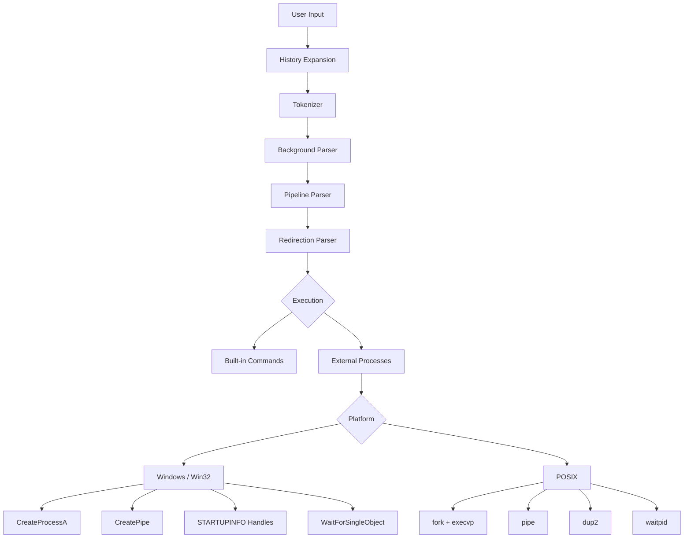

# ArsiShell

ArsiShell is a small command-line shell and process manager written in C++17. I built it to understand how shells create processes, connect programs with pipes, redirect input and output, run commands in the background, and keep track of jobs. It runs interactively from a terminal and focuses on practical operating systems concepts.

## Why I Built It

While studying Operating Systems, I learned about processes, inter-process communication, synchronization, and file I/O. I wanted to implement these ideas in real code instead of only learning the theory. Building a small shell was a direct way to see how an operating system kernel works with user programs.

## Features

- `cd` - changes the current working directory
- `pwd` - prints the current directory
- `echo` - prints text to the screen
- `history` - lists previously entered commands
- `!!` - repeats the previous command
- `!n` - repeats command number n from history
- `clear` - clears the terminal screen
- `help` - shows built-in commands and usage
- `exit` - exits the shell cleanly
- quoted arguments - supports single quotes (`'...'`) and double quotes (`"..."`)
- `<` - redirects standard input from a file
- `>` - redirects standard output to a file (overwrites)
- `>>` - appends standard output to a file
- single and multi-stage pipes - connects commands with `|`
- background execution with `&` - runs commands without blocking the prompt
- `jobs` - shows currently running background jobs
- `fg` - brings a background job to the foreground
- `bg` - checks status of background jobs
- `kill` - stops a running background job
- persistent history - saves command history across sessions
- job IDs and OS PIDs - tracks jobs using both shell job numbers (`[1]`, `[2]`) and operating system process IDs

## Example

```text
ArsiShell> pwd
D:\Masters-Projects\ArsiShell

ArsiShell> echo "Operating Systems" | findstr Systems
Operating Systems

ArsiShell> hostname > machine.txt

ArsiShell> tests\test_helper.exe 3000 &
[1] 14220

ArsiShell> jobs
[1] Running    PID 14220    tests\test_helper.exe 3000

ArsiShell> fg %1
tests\test_helper.exe 3000

ArsiShell> exit
```

## How It Works



## OS Concepts Used

- **Processes:** Every external program runs as a child process with its own memory space and resources.
- **Parent and Child Process Behavior:** Built-in commands like `cd` must run directly inside the shell process because a child process cannot change the parent shell's working directory. External programs run as child processes.
- **IPC with Pipes:** Anonymous pipes pass output from one program directly into the input of another. The shell must close unused write ends of pipes so the reading program receives an end-of-file signal instead of waiting forever.
- **Stdin and Stdout Redirection:** The shell can connect standard input and output to files instead of the terminal. Windows and POSIX use different APIs to do this.
- **Foreground vs Background Execution:** Foreground commands make the shell wait until the child finishes. Adding `&` runs the command in the background, so the shell prints a new prompt right away.
- **Job IDs vs OS PIDs:** The shell assigns simple numbers like `[1]` and `[2]` to track user jobs, while the operating system uses its own process IDs (PIDs). A pipeline job can contain multiple PIDs under one job ID.
- **Non-blocking Cleanup:** Before showing each prompt, the shell checks if any background processes have finished. If they are done, it cleans them up and prints a message without freezing the terminal.
- **Resource and Handle Cleanup:** Process, thread, and pipe handles are closed when they are no longer needed, so the shell does not keep OS resources open unnecessarily.

## Windows and POSIX

| Task           | Windows                        | POSIX                   |
| -------------- | ------------------------------ | ----------------------- |
| Create process | `CreateProcessA`               | `fork()` + `execvp()`   |
| Pipe           | `CreatePipe`                   | `pipe()`                |
| Redirection    | `STARTUPINFO` standard handles | `dup2()`                |
| Wait           | `WaitForSingleObject`          | `waitpid()`             |
| Terminate      | `TerminateProcess`             | `kill(..., SIGTERM)`    |
| Cleanup        | `CloseHandle`                  | `close()` / `waitpid()` |

Platform status: ArsiShell has been tested on Windows 11. A POSIX implementation is also included, but I have not yet tested it in a Linux environment.

## Build

Prerequisite:

A C++17-compatible compiler.

Direct build command:

```bash
g++ -std=c++17 -Wall -Wextra -Wpedantic src/main.cpp src/shell.cpp -o ArsiShell.exe
```

Build with CMake and Ninja:

```bash
cmake -S . -B build -G Ninja
cmake --build build
```

## Tests

The automated test suite contains 40 assertions. All 40 passed during the final Windows test run.

During a Windows stress test with 325 process, pipe, redirection, and background-job operations, the ArsiShell process returned to the same steady-state handle count after the test.

Run the tests:

```bash
python tests/run_tests.py
python tests/verify_handles.py
```

## Limitations

- no `&&`, `||`, or `;`
- no tab completion
- no arrow-key history navigation
- no environment-variable expansion
- Windows does not provide POSIX-style `SIGSTOP` / `SIGCONT` job control

## What I Learned

- I learned why unused pipe handles must be closed.
- I learned how a shell can check background processes without blocking.
- I learned why `cd` needs to run inside the shell process.
- I learned how Windows and POSIX use different APIs for similar process-management tasks.
- I learned why cleanup matters when working directly with OS handles.

## License

This project is licensed under the [MIT License](LICENSE).
