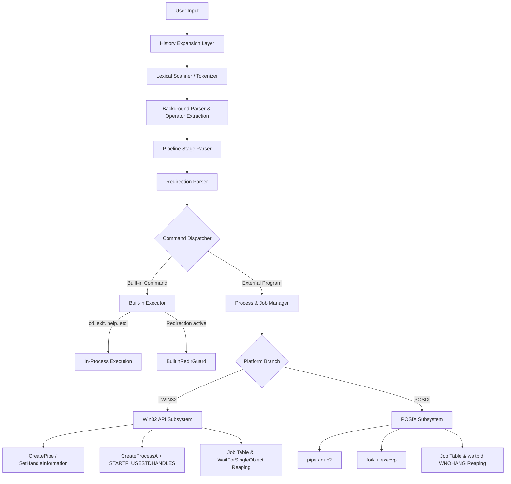
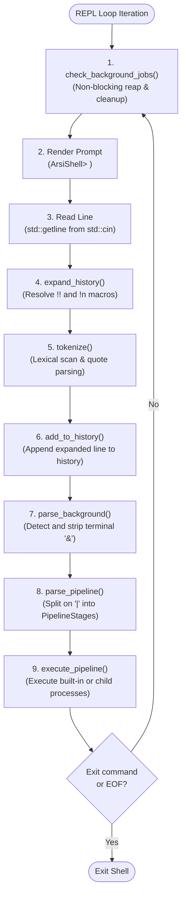

# ArsiShell Technical Architecture & Systems Design

This document outlines the software architecture, operating systems interactions, and kernel resource management strategies implemented in **ArsiShell**.

---

## 1. High-Level Architecture Diagram



---

## 2. The Shell REPL Lifecycle

The interactive Read-Eval-Print Loop is implemented in `run_shell()` (`src/shell.cpp`):



### Key Invariant: Reaping Before Prompt
Before the shell displays the prompt, it invokes `check_background_jobs()`. This non-blocking check interrogates the kernel for any asynchronous child processes that completed during the user's think time. If completed, ArsiShell prints `[<id>] Done <command>`, reaps their handles/exit codes, and removes them from the job table. This ensures the user is notified immediately without interrupting active interactive command typing.

---

## 3. Parsing Pipeline Stages

Command line processing is divided into distinct, decoupled phases:

### Phase 1: History Expansion (`expand_history`)
Before lexical tokenization, the raw line is checked for history operators:
- `!!` — replaced with the most recent command in `g_history`.
- `!n` — replaced with the $n$-th 1-based command in `g_history`.
The expanded string is echoed to `std::cout` (matching standard UNIX shell semantics) and then fed into the parser.

### Phase 2: Lexical Tokenization (`tokenize`)
A state-machine tokenizer scans character by character:
- Quotes (`'` and `"`) toggle a quoting state machine. Characters within quotes are preserved literally, including spaces, redirection operators (`<`, `>`), and pipeline symbols (`|`).
- Operators outside quotes (`<`, `>`, `>>`, `|`, `&`) are delimited into discrete tokens even when adjacent to arguments without spaces (e.g., `echo hello>file.txt` produces `["echo", "hello", ">", "file.txt"]`).
- Unclosed quotes trigger `syntax error: unclosed quote` and abort execution before launching processes.

### Phase 3: Background Detection (`parse_background`)
Scans for the `&` operator:
- Only valid as the final non-whitespace token outside quotes.
- If present, sets `is_background = true` and strips the `&` token.
- If `&` appears mid-command (e.g. `& cmd` or `cmd & extra`), a syntax error is returned.

### Phase 4: Pipeline Partitioning (`parse_pipeline`)
Splits the token stream on pipe operators (`|`):
- Each segment between pipes becomes a `PipelineStage` struct.
- Validates syntax: rejects leading pipes (`| cmd`), trailing pipes (`cmd |`), and empty stages (`cmd || cmd`).
- Validates redirection placement: `<` is strictly allowed only on stage 0; `>` and `>>` are strictly allowed only on the final stage.

### Phase 5: Redirection Extraction (`parse_redirection`)
For each stage, extracts redirection tokens:
- `< file` sets `redir.has_input = true` and `redir.input_file`.
- `> file` sets `redir.has_output = true`, `redir.append_output = false`, and `redir.output_file`.
- `>> file` sets `redir.has_output = true`, `redir.append_output = true`, and `redir.output_file`.
- Command arguments are stripped of redirection tokens and stored in `PipelineStage.args`.

---

## 4. Built-in vs. External Command Execution

### Why In-Process Built-ins Are Mandatory
Certain commands modify shell internal state and **cannot** execute in child processes:
- **`cd` (Change Directory):** An operating system process cannot alter the current working directory of its parent process. If `cd` were spawned as a child process via `CreateProcessA` or `fork/exec`, the child's working directory would change and immediately vanish upon child exit, leaving the shell unchanged.
- **`exit`:** Must signal the shell's own REPL loop to terminate.
- **`history`:** Reads the shell's internal in-memory history table.
- **`jobs`, `kill`, `fg`, `bg`:** Inspect and manipulate the shell's active job table.

### Handling Redirection for Built-ins (`BuiltinRedirGuard`)
When a built-in command is executed with redirection (e.g. `history > hist.txt`), ArsiShell uses an RAII guard `BuiltinRedirGuard` (`src/shell.cpp`):
1. Opens the target output file.
2. Redirects `std::cout.rdbuf()` to the file stream buffer.
3. Executes the built-in function in-process.
4. Upon destruction, flushes output and restores the original console stream buffer.

---

## 5. External Process Execution Architectures

### Windows Architecture (`CreateProcessA`)
Windows uses an explicit, parameter-rich process creation API:
```cpp
BOOL success = CreateProcessA(
    NULL,                   // Application name (resolved via PATH)
    command_line.data(),    // Modifiable command line string
    NULL,                   // Process security attributes
    NULL,                   // Thread security attributes
    bInheritHandles,        // Handle inheritance flag
    0,                      // Creation flags
    NULL,                   // Inherit environment block
    NULL,                   // Inherit current working directory
    &si,                    // STARTUPINFOA (carries redirected handles)
    &pi                     // PROCESS_INFORMATION (receives hProcess, hThread, dwProcessId)
);
```

#### Windows Handle Management Best Practices
1. **Immediate Thread Handle Closure:** `CreateProcessA` creates both a process kernel object and a primary thread kernel object. If `CloseHandle(pi.hThread)` is not called immediately, a kernel object leak occurs for every launched command. ArsiShell closes `pi.hThread` immediately after creation.
2. **Handle Inheritance Control:** When `bInheritHandles` is `TRUE`, the child inherits all handles marked with `HANDLE_FLAG_INHERIT`. To prevent child processes from inheriting irrelevant pipes or file handles, ArsiShell uses `SetHandleInformation()` to mark only intended handles inheritable.

### POSIX Architecture (`fork` + `execvp`)
POSIX separates process creation from executable loading:
1. `fork()`: Clones the parent process address space (using copy-on-write) and file descriptor table.
2. Child branch (`pid == 0`):
   - Configures descriptors: `dup2(fd_in, STDIN_FILENO)` and `dup2(fd_out, STDOUT_FILENO)`.
   - Closes extraneous file descriptors.
   - Calls `execvp(argv[0], argv.data())` to replace the address space with the new program.
3. Parent branch (`pid > 0`):
   - Retains child PID and handles synchronization or background tracking.

---

## 6. IPC Pipeline Design & Deadlock Prevention

### The Classical Pipe Deadlock Problem
In a multi-stage pipeline:
$$\text{Stage}_1 \xrightarrow{\text{Pipe}_1} \text{Stage}_2 \xrightarrow{\text{Pipe}_2} \dots \xrightarrow{\text{Pipe}_{N-1}} \text{Stage}_N$$
- Kernel pipe buffers have a finite capacity (typically 4KB–64KB).
- $\text{Stage}_2$ will read until it encounters End-Of-File (EOF).
- **The kernel generates EOF on a pipe ONLY when ALL write handles referencing that pipe are closed.**
- If the parent shell fails to close its own write handle (`pipes[i].hWrite`), the reference count never drops to zero. Even after $\text{Stage}_1$ terminates, $\text{Stage}_2$ will block forever in a read wait, creating a pipeline deadlock.

### ArsiShell's Pipe Lifetime Management
1. **Creation:** `CreatePipe()` creates anonymous pipes with inheritability enabled.
2. **Stage Loop:**
   - For stage $i$, stdin is set to `pipes[i-1].hRead` and stdout to `pipes[i].hWrite`.
   - `CreateProcessA` is called.
   - **Immediately after spawning stage $i$, the parent closes its copy of `pipes[i].hWrite`.**
   - **Immediately after spawning stage $i+1$, the parent closes its copy of `pipes[i].hRead`.**
3. **RAII Safety Guard (`PipeCleanupGuard`):** A stack-allocated guard ensures that if any stage fails to launch, all pipe handles in the vector are safely closed, preventing resource leaks.

---

## 7. Process & Job Management Architecture

### Job Table Model
```cpp
struct Job {
    int job_id;                            // Sequential ArsiShell ID (1, 2, 3...)
    std::vector<int> pids;                 // OS Process IDs
    std::string command_line;              // User command line representation
    JobStatus status;                      // Running, Done, Terminated, Stopped
    bool is_pipeline;                      // Multi-process pipeline indicator
#ifdef _WIN32
    std::vector<HANDLE> process_handles;   // Open process handles
#endif
};
```

### Pipelines as a Single Job
A command such as `prog1 | prog2 &` is tracked as **one job**:
- Contains two PIDs in `job.pids`.
- Contains two process handles in `job.process_handles`.
- `jobs` displays one cohesive entry.
- `fg` performs sequential synchronous waits on all handles.
- `kill` iterates over all handles, calling `TerminateProcess()`.

### Asynchronous Reaping
In `check_background_jobs()`:
```cpp
#ifdef _WIN32
for (HANDLE h : job.process_handles) {
    if (WaitForSingleObject(h, 0) != WAIT_OBJECT_0) {
        all_done = false;
        break;
    }
}
#else
for (int pid : job.pids) {
    int status = 0;
    if (waitpid(pid, &status, WNOHANG) != pid) {
        all_done = false;
        break;
    }
}
#endif
```
When all processes in the job have terminated:
1. Notification printed: `[<id>] Done    <command>`
2. All process handles closed via `CloseHandle()`.
3. Job removed from table.

---

## 8. Verified Kernel Handle Safety (Windows)

To verify that ArsiShell cleans up handles properly, process handle counts were measured directly using the Windows Win32 API (`GetProcessHandleCount`):

```text
[Baseline Steady-State Handles] : 59 handles
[100 External Process Launches] : 59 handles (delta: 0)
[100 I/O Redirection Cycles]    : 59 handles (delta: 0)
[100 Multi-Stage Pipelines]     : 59 handles (delta: 0)
[25 Background Reaping Cycles]  : 59 handles (delta: 0)
[Final Handle Count]            : 59 handles
[Net Handle Leak Delta]         : 0 HANDLES
```

### Resource Cleanup Summary
- **Thread Handles:** Closed immediately after `CreateProcessA`.
- **File Handles:** Managed via RAII guards and closed immediately upon child spawn.
- **Pipe Handles:** Explicitly closed during pipeline progression and cleaned via `PipeCleanupGuard`.
- **Process Handles:** Stored strictly while active and closed upon reaping, foregrounding, termination, or shell exit.

---

## 9. Known Limitations & Design Trade-offs

1. **POSIX Job Suspension on Windows:** Win32 console applications do not support UNIX `SIGSTOP`/`SIGCONT` semantics. ArsiShell honestly reports status rather than faking unsupported process suspension.
2. **No Terminal Line Discipline / Raw Mode:** Terminal input uses `std::getline(std::cin)`. Interactive cursor navigation, tab auto-completion, and inline history recall (readline-style) require terminal raw mode / curses and are omitted to keep the focus on OS process primitives.
3. **No Command Chaining:** Logical operators (`&&`, `||`) and sequence separators (`;`) were excluded by design to focus strictly on process lifecycle and IPC.
