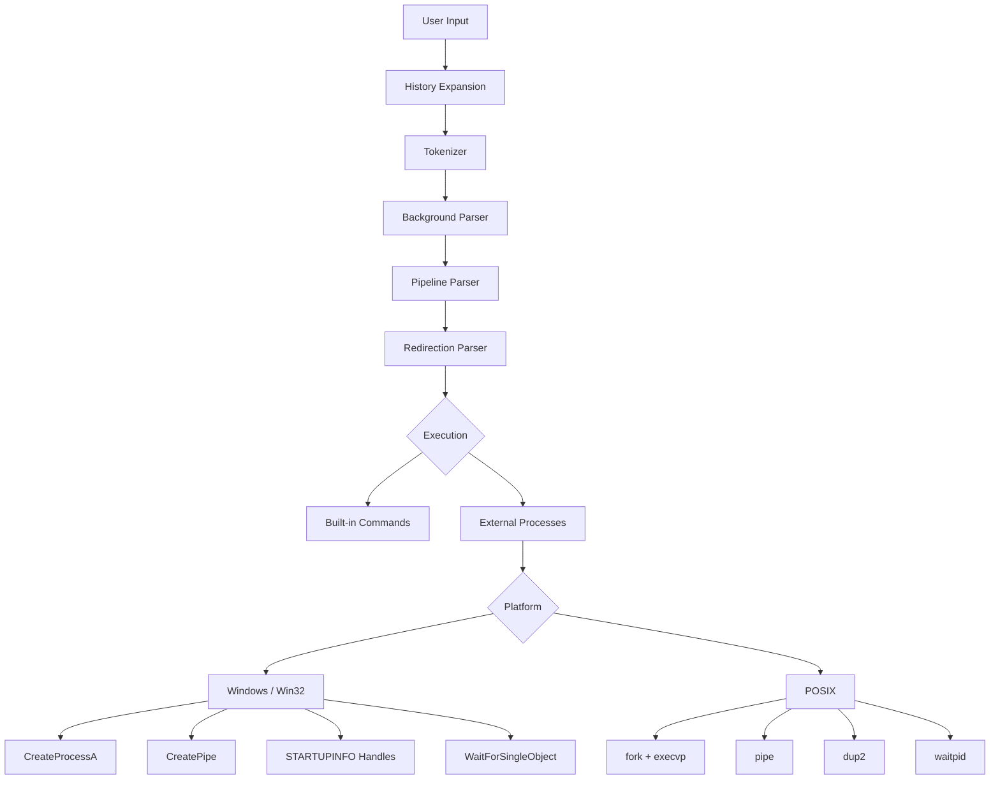
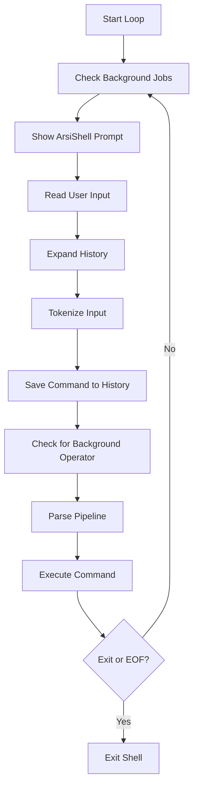

# ArsiShell Architecture

This document explains how ArsiShell handles commands internally. It covers command parsing, process creation, pipes, redirection, background jobs, and OS resource cleanup.

ArsiShell is written in C++17. The Windows implementation uses Win32 APIs, while a POSIX implementation is included for Linux/Unix systems.

> **Platform status:** ArsiShell has been tested on Windows 11. The POSIX implementation is included in the source code, but I have not yet tested it in a Linux environment.

---

## 1. System Overview

A command passes through several steps before it is executed.



The parser first deals with history and shell operators. After parsing is complete, ArsiShell decides whether the command should run inside the shell itself or as an external process.

---

## 2. Shell Loop

The main shell loop is implemented in `run_shell()` in `src/shell.cpp`.



Before showing each new prompt, ArsiShell calls `check_background_jobs()`.

This check does not block the shell. It looks at currently tracked background processes and checks whether they have finished.

If a job is complete, ArsiShell prints a message such as:

```text
[2] Done    command
```

The finished job is then cleaned up and removed from the job table.

This lets the shell report finished background work without freezing the prompt.

---

## 3. How Commands Are Parsed

Command parsing happens in several small stages instead of one large function.

### 3.1 History Expansion

Function:

```cpp
expand_history()
```

Before tokenizing a command, ArsiShell checks for history shortcuts.

Supported forms:

```text
!!
!n
```

`!!` repeats the previous command.

`!n` loads command number `n` from the command history.

After expansion, the resulting command goes through the normal parser again. This means recalled commands can still contain pipes, redirection, or background execution.

---

### 3.2 Tokenization

Function:

```cpp
tokenize()
```

The tokenizer reads the command one character at a time.

It handles:

- spaces and tabs
- single quotes
- double quotes
- `<`
- `>`
- `>>`
- `|`
- `&`

Operators inside quotes are kept as normal text.

For example:

```text
echo "A | B"
```

does not create a pipeline.

The tokenizer also recognizes operators without surrounding spaces.

For example:

```text
echo hello>file.txt
```

is parsed in the same way as:

```text
echo hello > file.txt
```

If a quote is opened but never closed, ArsiShell reports a syntax error before trying to start a process.

---

### 3.3 Background Detection

Function:

```cpp
parse_background()
```

The background operator `&` is accepted only at the end of a command or pipeline.

Valid:

```text
hostname &
```

```text
command1 | command2 &
```

Invalid:

```text
& hostname
```

```text
hostname & extra
```

When a valid final `&` is found, ArsiShell removes it from the command tokens and marks the command for background execution.

---

### 3.4 Pipeline Parsing

Function:

```cpp
parse_pipeline()
```

The parser splits commands on `|`.

For example:

```text
command1 | command2 | command3
```

becomes three pipeline stages.

For `N` stages, ArsiShell needs `N - 1` pipes.

The parser rejects malformed pipelines such as:

```text
| command
```

```text
command |
```

```text
command | | command
```

Input redirection `<` is only allowed on the first stage of a pipeline.

Output redirection `>` or `>>` is only allowed on the final stage.

---

### 3.5 Redirection Parsing

Function:

```cpp
parse_redirection()
```

Each pipeline stage is checked for redirection operators.

Input redirection:

```text
command < input.txt
```

Output redirection:

```text
command > output.txt
```

Append redirection:

```text
command >> output.txt
```

The redirection tokens and filenames are removed from the normal command argument list before execution.

The parser also checks for errors such as missing filenames or multiple conflicting redirections.

---

## 4. Built-in and External Commands

ArsiShell handles built-in commands differently from external programs.

### Built-in Commands

Some commands need access to the shell's own state.

Examples include:

```text
cd
exit
history
jobs
fg
bg
kill
```

`cd` is the clearest example.

If `cd` ran in a child process, it would only change the working directory of that child. When the child exited, the ArsiShell process would still be in the old directory.

For that reason, `cd` runs directly inside the shell process.

`exit` also needs to run inside the shell because it controls the shell's own main loop.

Commands such as `history` and `jobs` need access to data stored inside ArsiShell itself.

---

### Built-in Output Redirection

Built-in commands can also use output redirection.

For example:

```text
history > history.txt
```

ArsiShell uses `BuiltinRedirGuard` for this.

The basic process is:

1. Open the output file.
2. Temporarily connect `std::cout` to that file.
3. Run the built-in command.
4. Flush the stream.
5. Restore `std::cout` to the terminal.

The guard uses RAII, so restoration also happens when the function leaves its scope.

---

## 5. Creating External Processes

External programs are started using different APIs on Windows and POSIX systems.

### Windows

The Windows implementation uses:

```cpp
CreateProcessA()
```

A simplified version of the call looks like this:

```cpp
BOOL success = CreateProcessA(
    NULL,
    command_line.data(),
    NULL,
    NULL,
    bInheritHandles,
    0,
    NULL,
    NULL,
    &si,
    &pi
);
```

`PROCESS_INFORMATION` gives ArsiShell information about the created process, including:

```cpp
pi.hProcess
pi.hThread
pi.dwProcessId
```

The thread handle is not needed after process creation, so ArsiShell closes it.

```cpp
CloseHandle(pi.hThread);
```

The process handle is kept only for as long as the shell needs it for waiting, background tracking, job control, or cleanup.

---

### POSIX

The POSIX implementation uses:

```text
fork()
execvp()
```

`fork()` creates a child process.

Inside the child, file descriptors can be changed before starting the requested program.

For example:

```cpp
dup2(fd_in, STDIN_FILENO);
dup2(fd_out, STDOUT_FILENO);
```

The child then calls:

```cpp
execvp(...)
```

to replace itself with the requested program.

The parent keeps the child's PID so it can wait for the process or track it as a background job.

The POSIX code is included in ArsiShell, but it has not yet been runtime-tested on Linux.

---

## 6. Pipes and Deadlock Prevention

Pipes allow one program to send output directly to another program.

For example:

```text
command1 | command2
```

ArsiShell connects the standard output of `command1` to the standard input of `command2`.

On Windows, pipes are created with:

```cpp
CreatePipe()
```

On POSIX, the equivalent pipe creation uses:

```cpp
pipe()
```

### Why Closing Pipe Handles Matters

A process reading from a pipe waits until it receives either more data or an end-of-file condition.

The end-of-file condition only appears after every open write handle for that pipe has been closed.

This means the parent shell must not keep an unused write handle open.

If it does, the reading process may continue waiting even after the program writing to the pipe has already finished.

ArsiShell closes pipe handles as soon as the parent no longer needs them.

For a multi-stage pipeline:

```text
command1 | command2 | command3
```

the connections are logically:

```text
command1 -> pipe 1 -> command2 -> pipe 2 -> command3
```

Each process receives only the standard input and output handles needed for its stage.

ArsiShell also uses cleanup guards so that pipe handles are closed if a process fails to start partway through pipeline creation.

---

## 7. Background Jobs and Process Tracking

Background execution is started with:

```text
&
```

For example:

```text
tests\test_helper.exe 3000 &
```

Instead of waiting for the process to finish, ArsiShell returns control to the prompt.

The process is stored in an internal job table.

The job structure contains information similar to:

```cpp
struct Job {
    int job_id;
    std::vector<int> pids;
    std::string command_line;
    JobStatus status;
    bool is_pipeline;

#ifdef _WIN32
    std::vector<HANDLE> process_handles;
#endif
};
```

### Job IDs and PIDs

ArsiShell gives each background job a small sequential ID:

```text
[1]
[2]
[3]
```

These are different from operating system process IDs.

For example:

```text
[1] 14220
```

Here:

```text
1
```

is the ArsiShell job ID.

```text
14220
```

is the OS PID.

---

### Pipelines as One Job

A background pipeline such as:

```text
program1 | program2 &
```

is stored as one ArsiShell job.

That one job can contain multiple PIDs.

This lets commands such as:

```text
jobs
fg
kill
```

work on the complete pipeline instead of treating every stage as an unrelated job.

---

### Checking Background Jobs

ArsiShell checks background jobs without blocking the shell.

On Windows it uses:

```cpp
WaitForSingleObject(hProcess, 0)
```

The timeout value `0` means the function checks the process state immediately instead of waiting.

On POSIX, the equivalent implementation uses:

```cpp
waitpid(pid, &status, WNOHANG)
```

When every process belonging to a job has finished, ArsiShell:

1. prints a completion message
2. closes the process handles
3. removes the job from the job table

---

### `fg`

The `fg` command waits for a background job to finish.

For a pipeline job, ArsiShell waits for all processes that belong to that job.

---

### `kill`

The `kill` command only works on jobs already tracked by ArsiShell.

On Windows, ArsiShell uses:

```cpp
TerminateProcess()
```

On POSIX, the implementation uses:

```cpp
kill(pid, SIGTERM)
```

These are different operating system mechanisms, but both are used here to request or perform termination of a tracked process.

---

### `bg`

POSIX systems support signals such as:

```text
SIGSTOP
SIGCONT
```

Windows does not provide the same POSIX-style job suspension model for console processes.

Because of this, ArsiShell does not pretend to support POSIX-style resume behavior on Windows. On Windows, `bg` reports the current background state when the job is already running.

---

## 8. Windows Handle Testing

ArsiShell uses Win32 kernel handles for processes, threads, pipes, and files.

If these handles are not closed correctly, a long-running shell can slowly keep more OS resources open.

To check this, `tests/verify_handles.py` uses:

```cpp
GetProcessHandleCount()
```

to measure the ArsiShell process handle count before and after repeated operations.

The Windows stress workload included:

| Test | Operations | Handle count after test |
| --- | ---: | ---: |
| Starting external processes | 100 | 59 |
| I/O redirection cycles | 100 | 59 |
| Multi-stage pipelines | 100 | 59 |
| Background job cycles | 25 | 59 |
| **Total** | **325** | **59** |

The steady-state count before the workload was also:

```text
59
```

After all 325 operations, the count returned to:

```text
59
```

So no handle-count growth was detected in this stress workload.

This test does not prove that a handle leak is impossible in every possible execution path, but it gives a useful check that the tested process, pipe, redirection, and background-job paths return their handles correctly.

---

## 9. Resource Cleanup

Different resources have different lifetimes.

### Thread Handles

After `CreateProcessA()` returns, ArsiShell closes the primary thread handle because it does not need to keep it.

### Process Handles

Foreground process handles are closed after the process has finished.

Background process handles are kept while the job is active and closed when the job finishes, is terminated, is brought to the foreground, or when ArsiShell exits.

### Pipe Handles

Parent-side pipe handles are closed as soon as they are no longer needed.

This is important both for resource cleanup and for correct EOF behavior.

### File Handles

Handles used for input or output redirection are closed after they are no longer needed.

RAII guards are also used in places where cleanup must happen automatically when leaving a scope.

---

## 10. Limitations

ArsiShell intentionally does not try to implement every feature of Bash, PowerShell, or other full shells.

Current limitations include:

- no `&&`
- no `||`
- no `;`
- no tab completion
- no arrow-key history navigation
- no environment variable expansion such as `$VAR`
- no POSIX-style `SIGSTOP` / `SIGCONT` job suspension on Windows

Terminal input currently uses normal line input with `std::getline()`.

Features such as interactive cursor movement, tab completion, and readline-style history would require a different terminal input layer.

The current project stays focused on process creation, pipes, redirection, background execution, job tracking, and OS resource management.
